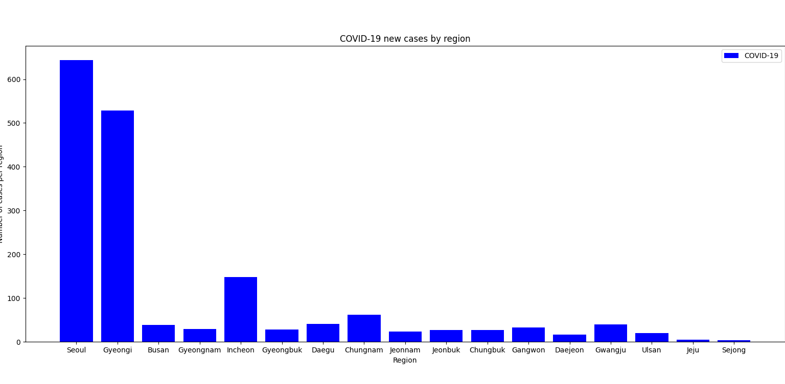
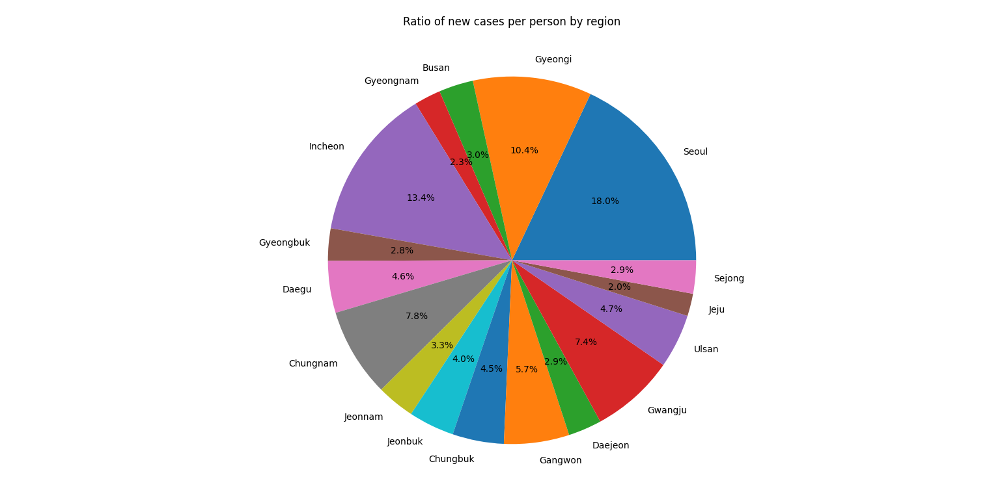

# COVID-19 Statestics

## To do 
* [x] Calculate the number of cases per its population
* [x] Calculate the total number of people  
* [x] Calculate the total number of new cases
* [x] The ratio of new cases to the total
* [x] Print COVID-19 new cases by region

## What I added

### I have added a graph of COVID-19 new cases by region
  


#### code :

```py
plt.bar(regions, n_covid ,label="COVID-19", width = 0.8, color = ['blue']) # view of the bar
plt.xlabel('Region') # x label
plt.ylabel('Number of cases per region') # y label
plt.title('COVID-19 new cases by region') # title of the graph
plt.legend() # add legend

plt.show() # show the graph
```

### I have added a graph of the ratio of new cases per person by region



### code :

```py
ratio = []
for idx, pop in enumerate(n_covid):
    ratio.append(n_covid[idx]*100/n_people[idx]) # Calculate ratio
plt.pie(ratio, labels = regions, autopct = '%1.1f%%') # view of the pie
plt.title("Ratio of new cases per person by region") # title of the graph
plt.show() # show the graph
```
