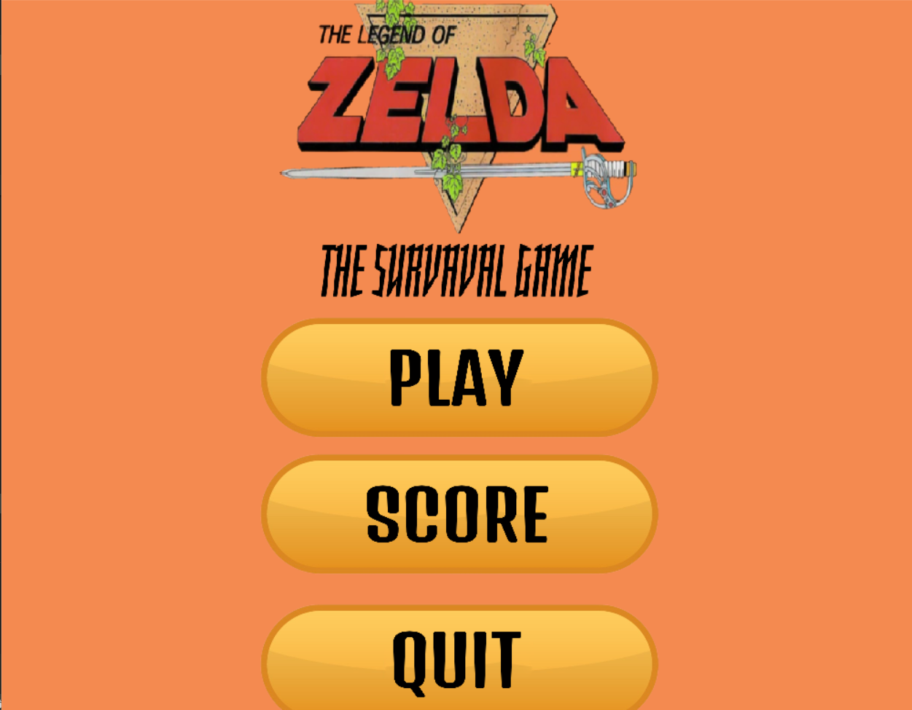
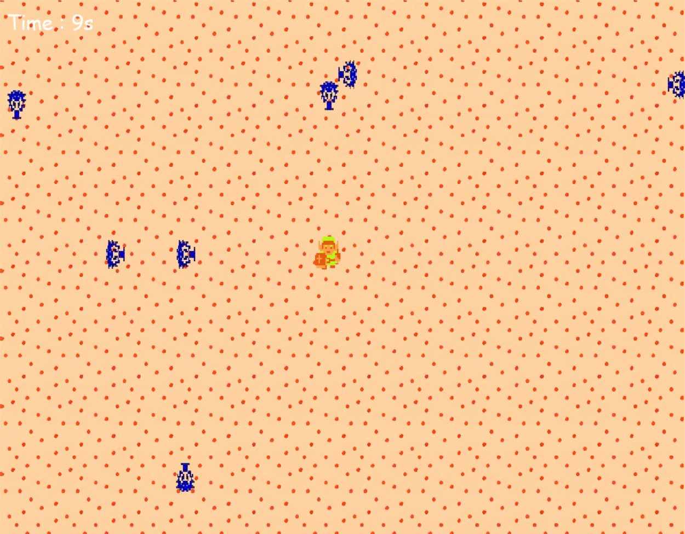
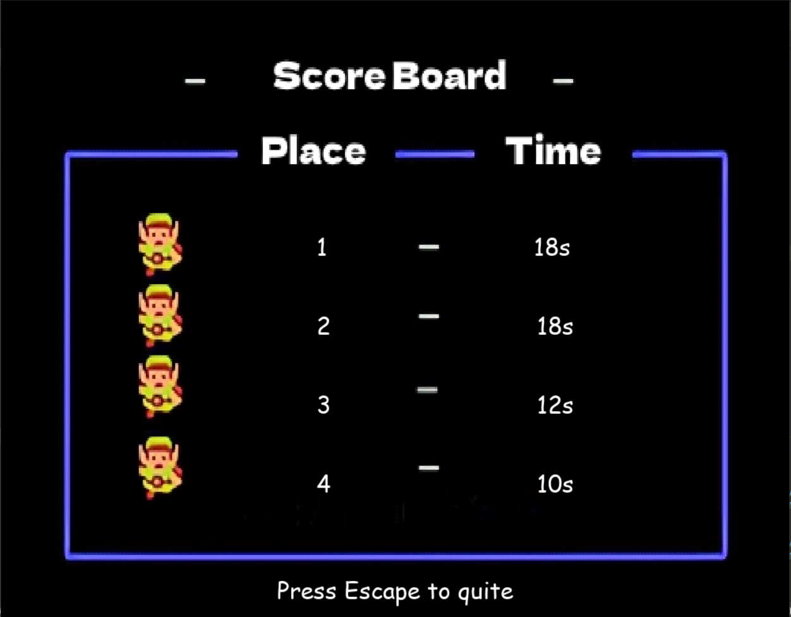

# Zelda Nes Survivor (fan game)

## Concept

The concept of the game is to survive at some wave of enemies who spawn randomly, you have timer who indict your time and a scorboard with the best times. The game is on the Zelda NES theme, the enemies and the charactere are from this game.

## Done

* [x] Add a timer
* [x] And some ~~intelligentes~~ enemies
* [x] Add a concept of scoring (time pass to survive)
* [x] Change the window title for __Zelda 1 : Survival game__
* [x] Add 3 different BackGround
* [x] Add a system of difficulty against different stage
* [x] Add a Menu

## Keys

You can control link with the arrow keys to dodge the enemies.
You can press the escape key to open the menu (if you do this the game restart)
You can close the window by clicking the close button (the cross in the top right corner of the window)

## Photos

### Menu

### InGame

### Scoreboard

